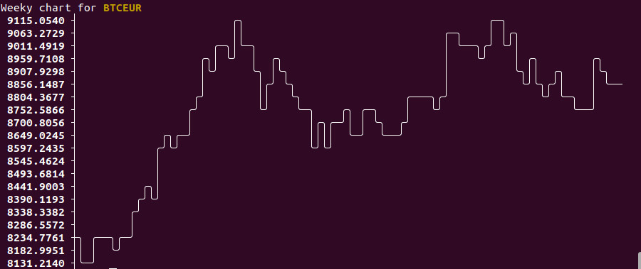
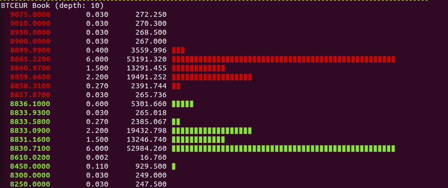

# Coinmetro-CLI





A little side project i made in my spare time (and still a work in progress) for accessing Coinmetro Crypto Exchange using the terminal.

Coinmetro are a transparent, regulations compliant exchange that should appeal to newbies and pros. Visit [coinmetro.com](https://coinmetro.com/) to learn more about the different products they offer.

Please note this is not an official Coinmetro product, it is in early stages, so use at your own risk or use demo mode. The application does not and never will store or transmit your credentials in any way (feel free to examine the source)

## Installation

### From source (recommended)
Coinmetro CLI is a node.js application, so you need [node.js](https://nodejs.org/en/) installed to run it.

If you know how to use git just clone the repository, then install it with npm:

```
    cd coinmetro-cli
    npm install -g ./
```

This will install Coinmetro CLI as a global command. You can then use your terminal to input your commands.

### Binaries

Binaries are packaged using [pkg](https://github.com/zeit/pkg) utility. Look under [releases](https://github.com/u2ros/coinmetro-cli/releases) to download the release for your platform. Rename the downloaded executable into cm (or cm.exe on windows) and place it somewhere on your PATH, or cd your terminal to the same folder where you unpacked and renamed your cm(.exe) executable.

**IMPORTANT: Always use binaries you downloaded from this site. Never use any third party download links!!!**

## Usage

Coinmetro-CLI will start in demo mode by default. If you want to use it with your actual balance, issue the command below. This is followed by an 'auth login command', which updates your login token and enable you to use trading/balance functions related to your account. If you want to start in demo mode, omit the 'cm auth live' command.

```
    cm auth live                                  // switch to live mode
    cm auth login <your email> <your password>    // login to update accesss token
```

The syntax of commands follows this convention:

```
    cm <command> <subcommand> [<args>]

    Example:
    cm market book btceur
```

Some args are optional and my not be needed. Use help option with any subcommand to learn what are the defaults or check the reference below. If you need help with a specific command you can use:

```
    cm <command> <subcommand> ?

    Example:
    cm market chart ?

```
*Tip: Pairs and currencies are printed in upper case. When inputing you can use lower case to speed up typing. xcm instead of XCM*

*Tip: You can have multiple terminal windows opened and use them for issuing different commands*

## Errors

There are two types of errors that can occur:

- server errors which will be the result of semantically incorrrect arguments that are denied by the coinmetro servers
- argument errors which will happen when the user inputs invalid, missing or incorrect arguments

An error message will be printed and here are the most common error messages and what to do

- Invalid Token (status: 401): Your access token is no longer valid. Use cm auth login command to update it
- Error 422: You need to confirm this device IP (via email) before logging in

## Roadmap

No particular roadmap atm. There's some due diligence (code cleanup, tests, refactor). Feature wise I will add/change/remove features as i converge on typical use patterns. All orders that are created with this app are limit orders as I don't see much point in adding market orders at the moment. I also ignore TraM orders even if you specify tram as a product for listing orders. Feel free to open a feature request or report a bug by opening an issue on github.

## Command reference

Here is a list of available commands.

- [cm auth demo](#auth-demo) - activate demo mode
- [cm auth live](#auth-live) - activate live mode
- [cm auth login](#auth-login) - login using your credentials
- [cm balance list](#balance-list) - list your balances
- [cm market list](#market-list) - list available markets (pairs)
- [cm market chart](#market-chart) - draw a market chart
- [cm market book](#market-book) - display market order book
- [cm order list](#order-list) - list open orders
- [sm order history](#order-history) - list closed orders
- [cm order buy](#order-buy) - place a buy order
- [cm order sell](#order-sell) - place a sell order
- [cm order mbuy](#order-mbuy) - place a multi buy (iceberg) order
- [cm order msell](#order-msell) - place a multi sell (iceberg) order
- [cm order cancel](#order-cancel) - cancel a single order using order id
- [cm order mcancel](#order-mcancel) - cancel multiple orders using criteria

### <a name="auth-demo"></a> cm auth demo

Change to demo mode. After activating the demo mode, you need to update your login token using [cm auth login command](#auth-login).

```
    Syntax:
    cm auth demo

    Example:
    cm auth demo
```

### <a name="auth-live"></a> cm auth live

Change to live mode. After activating the live mode, you need to update your login token using [cm auth login command](#auth-login).

```
    Syntax:
    cm auth live

    Example:
    cm auth live
```

### <a name="auth-login"></a> cm auth login

Login to exchange to obtain access token. If successfull, the command will also indicate which mode (demo|live) you are currently using

```
    Syntax:
    cm auth login <username> <password>

    username: required, your email address
    password: required, your password
```

```
    Example:
    cm auth login whale@gmail.com pumpndump
```

### <a name="balance-list"></a> cm balance list

List your balances

```
    Syntax:
    cm balance list
```

```
    Example:
    cm balance list
```

### <a name="market-list"></a> cm market list

List available trading pairs (markets)

```
    Syntax:
    cm market list
```

```
    Example:
    cm market list
```

### <a name="market-chart"></a> cm market chart

Display a price chart for the specified pair and timeframe

```
    Syntax:
    cm market chart <pair> [<timeframe d|w|m|y>]

    pair     : required
    timeframe: chart timeframe, possible values are: d, w (default), m, y
```

```
    Example:
    cm market chart btceur d // display bitcoin market chart for last 24 hours
```

### <a name="market-book"></a> cm market book
Display current order book of a specific market

```
    Syntax:
    cm market book <pair> [rows>]

    pair     : required
    rows     : number of rows to display on buy and sell side, default 10
```

```
    Example:
    cm market book btceur 5  // display bitcoin order book with 5 rows on buy and sell side
```

### <a name="order-list"></a> cm order list
Display list of open orders

```
    Syntax:
    cm order list  <pair> [<product>]

    pair     : required
    product  : type of open orders to display, 'ex' or 'tram', default ex
```

```
    Example:
    cm order open btceur // display all open orders on btceur market
```
### <a name="order-history"></a> cm order history
Display list of closed orders (canceled, filled)

```
    Syntax:
    cm order history <pair> [<kind filled|all> <since YYYY-MM-DD>]

    pair     : required
    kind     : type of open orders to display, 'filled' or 'all', default 'filled'
    since    : date in format YYYY-MM-DD, default
```

```
    Example:
    cm order history btceur all 2020-04-05 // display all closed orders on btceur pair from 2020-04-05 till today
```

### <a name="order-buy"></a> cm order buy
Place a limit buy order

```
    Syntax:
    cm order buy <buy quantity> <buy currency> @<price> <sell currency> [<time in force: gtc|ioc|gtd|fok> <duration (s)>

    buy quantity : required
    buy currency : required
    price        : required specified in format @<price>
    sell currency: required,
    time in force: time in force, default gtc (good till canceled), can be gtc, ioc, gtd, fok
    duration     : duration of order in seconds, default 10. applicable if time in force is set to 'gtd'
```

```
    Example:
    cm order buy 10000 xcm @0.75 eur gtd 10 // buy 10k xcm at 0.75 with euro (xcmeur pair), keep the order for 10 seconds
```

### <a name="order-sell"></a> cm order sell
Place a limit sell order

```
    Syntax:
    cm order sell <sell quantity> <sell currency> @<price> <buy currency> [<time in force: gtc|ioc|gtd|fok> <duration (s)>]

    sell quantity : required
    sell currency : required
    price         : required specified in format @<price>
    buy currency  : required,
    time in force : time in force, default gtc (good till canceled), can be gtc, ioc, gtd, fok
    duration      : duration of order in seconds, default 10. applicable if time in force is set to 'gtd'
```

```
    Example:
    cm order sell 10000 xcm @0.75 eur gtd 10 // sell 10k xcm at 0.75 for euro (xcmeur pair), keep the order for 10 seconds
```

### <a name="order-mbuy"></a> cm order mbuy
Place a limit multi buy order. Order will be divided into specified number of smaller chunk orders in the specified price range.

```
    Syntax:
    cm order mbuy <buy quantity> <buy currency> @<price range> <sell currency> <order count> [<time in force: gtc|ioc|gtd|fok> <duration (s)>]

    buy quantity : required
    buy currency : required
    price range  : required, specified in format @<start price>-<end price>
    sell currency: required,
    order count  : required, specifies into how many chunks to split the order
    time in force: time in force, default gtc (good till canceled), can be gtc, ioc, gtd, fok
    duration     : duration of order in seconds, default 10. applicable if time in force is set to 'gtd'
```

```
    Example:
    cm order mbuy 10000 xcm @0.01-0.02 eur 10 gtc 10 // buy 10k xcm in range from 0.01 to 0.02 with euro (xcmeur pair), split into 10 chunks, keep the order for 10 seconds
```
### <a name="order-msell"></a> cm order msell
Place a limit multi sell order. Order will be divided into specified number of smaller chunk orders in the specified price range.

```
    Syntax:
    cm order msell <sell quantity> <sell currency> @<start price>-<end price> <buy currency> <order count> [<time in force: gtc|ioc|gtd|fok> <duration (s)>]

    buy quantity : required
    buy currency : required
    price range  : required, specified in format @<start price>-<end price>
    sell currency: required,
    order count  : required, specifies into how many chunks to split the order
    time in force: time in force, default gtc (good till canceled), can be gtc, ioc, gtd, fok
    duration     : duration of order in seconds, default 10. applicable if time in force is set to 'gtd'
```

```
    Example:
    cm order msell 10000 xcm @0.5-0.6 EUR 10 gtc 10 // sell 10k xcm in range from 0.5 to 0.6 for eur (xcmeur pair), split into 10 chunks, keep the order for 10 seconds
```

### <a name="order-cancel"></a> cm order cancel
Cancel an order with specific order ID

```
    Syntax:
    cm order cancel <order id>

    order id : required
```

```
    Example:
    cm order cancel 5a902cb722a7b962b93234dsfd9b15895286891136ed60b54270a136b
```

### <a name="order-mcancel"></a> cm order mcancel
Cancel multiple orders that fit specific criteria

```
    Syntax:
    cm order mcancel <pair> [<mode byprice|bydate> @<start price>-<end price>|<start date YYYY-MM-DD> <start time hh:mm> <end date>YYYY-MM-DD> <end time hh:mm>]

    pair       : required
    mode       : optional, 'byprice' or 'bydate'. This governs the use of additional args below
    price      : required if mode byprice is specified. Price is passed in the format '@<start price><end price>'
    start date : required if mode bydate is specified. Format is YYYY-MM-DD
    start time : required if mode bydate is specified. Format is hh:mm
    end date   : required if mode bydate is specified. Format is YYYY-MM-DD
    end time   : required if mode bydate is specified. Format is hh:mm
```

```
    Example:
    cm order mcancel xcmeur                                          // cancel all open xcmeur orders
    cm order mcancel xcmeur byprice @0.03-0.04                       // cancel all open xcmeur orders between 3 and 4c
    cm order mcancel xcmeur bydate 2020-01-07 7:00 2020-01-09 12:00  // cancel all open xcmeur order placed between specified dates
```
